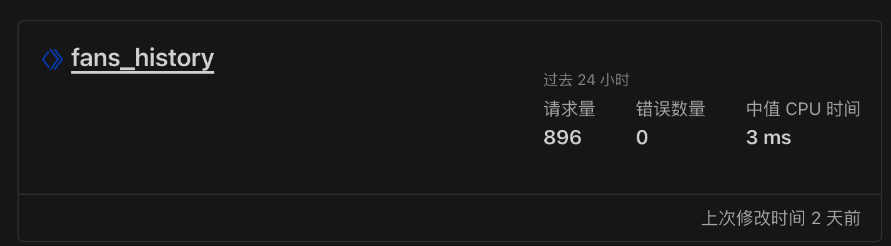

# 哔哩哔哩 UP 粉丝数量动态图

- [哔哩哔哩 UP 粉丝数量动态图](#哔哩哔哩-up-粉丝数量动态图)
  - [在线演示](#在线演示)
  - [功能](#功能)
  - [Cloudflare 服务](#cloudflare-服务)
  - [wrangler 的安装](#wrangler-的安装)
  - [D1 数据库](#d1-数据库)
  - [Cloudflare workers 后端](#cloudflare-workers-后端)
  - [Cloudflare Workers 后端](#cloudflare-workers-后端-1)
  - [Cloudflare Pages 前端](#cloudflare-pages-前端)
  - [参考资料](#参考资料)

## [在线演示](https://fans-history.awsl.icu/)

## 功能

- [x] Cloudflare D1 作为数据库
- [x] 使用 Cloudflare Pages 部署前端
- [x] 使用 Cloudflare Workers 部署后端

---

## Cloudflare 服务

- `D1` 是 `Cloudflare` 的原生无服务器数据库。
- `Pages` 是 `Cloudflare` 的静态网站托管服务, 速度超快，始终保持最新状态。
- `Workers` 是 `Cloudflare` 的 `serverless` 应用服务，可以在全球 300 个数据中心运行代码, 而无需配置或维护基础架构。
- `Cloudflare Email Routing` 可以处理域名的所有电子邮件流量，而无需管理电子邮件服务器。

---

## wrangler 的安装

安装 wrangler

```bash
npm install wrangler -g
```

克隆项目

```bash
git clone https://github.com/dreamhunter2333/fans_count_history.git
```

---

## D1 数据库

第一次执行登录 wrangler 命令时，会提示登录, 按提示操作即可

```bash
# 创建 D1 并执行 schema.sql
wrangler d1 create dev
wrangler d1 execute dev --file=db/schema.sql
```

创建完成后，我们在 cloudflare 的控制台可以看到 D1 数据库


---

## Cloudflare workers 后端

初始化项目

```bash
cd worker
pnpm install
cp wrangler.toml.template wrangler.toml
```

修改 `wrangler.toml` 文件

```bash
name = "fans_history"
main = "src/worker.js"
compatibility_date = "2023-08-14"
node_compat = true

[triggers]
crons = [ "0 0 * * *" ]

[vars]
JWT_SECRET = "xxx" # 用于生成 jwt 的密钥

[[d1_databases]]
binding = "DB"
database_name = "xxx" # D1 数据库名称
database_id = "xxx" # D1 数据库 ID
```

---

## Cloudflare Workers 后端

部署

```bash
pnpm run deploy
```

部署成功之后再路由中可以看到 `worker` 的 `url`，控制台也会输出 `worker` 的 `url`



---

## Cloudflare Pages 前端

```bash
cd frontend
pnpm install
cp .env.example .env.local
```

修改 `.env.local` 文件, 将 `VITE_API_BASE` 修改为 `worker` 的 `url`, 不要在末尾加 `/`

例如: `VITE_API_BASE=https://xxx.xxx.workers.dev`

```bash
pnpm build --emptyOutDir
# 根据提示创建 pages
pnpm run deploy
```


## 参考资料

- https://developers.cloudflare.com/d1/
- https://developers.cloudflare.com/pages/
- https://developers.cloudflare.com/workers/
- https://developers.cloudflare.com/email-routing/
